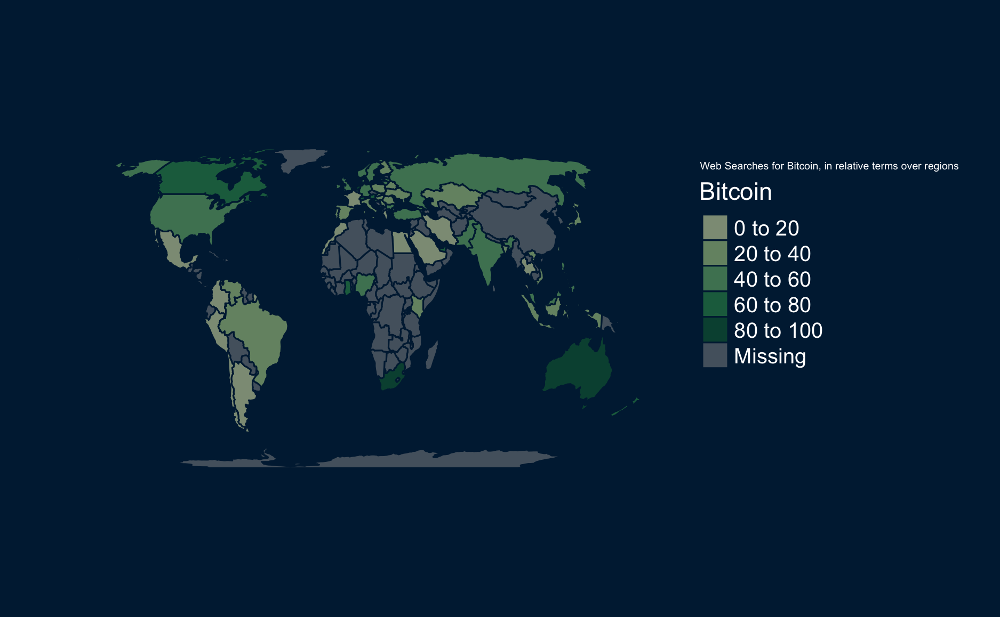

# The Bitcoin Hype {.tabset .tabset-sticky}
**Price of and the Interest in Bitcoins in the last few months **
(from October 2017 - February 2018) 


On this website we present our Data Visualization Project where we show different visualizations of bitcoins regarding the development of the price and magnitude of interest over time and regions of the world. 

1. First we [created the data](0_create.nb.html).
2. Then we [wrangled the data ](1_wrangle.nb.html).
3. Then we [plotted](2_plot.nb.html) it.

On this Page we show the "final version", a combination of A) sparklines that visualize the developments of the price of one bitcoin and the development of the amount of web searches and B) the visualization of the amount of web searches in the different regions of the world.
Enjoy:

Web Searches for the Term Bitcoin by Region:


Price of Bitcoin, Price Difference of Bitcoin Price (Spread), Total Volume of Bitcoins, Web-Interest in Bitcoins, News Coverage on Bitcoin over time:


## Authors & Acknowledgements {.tabset .tabset-sticky}
### Authors
Lisa Reiber, Ruta Daktariunaite, Florian Kaiser

### Acknowledgements {.active}
A big thank you to Ruben Arslan for development of reproducible visualization of research projects on the web (repro-web-stack) [click here for more Info](https://github.com/rubenarslan/repro_web_stack)

#### Package bibliography {.tabset .tabset-sticky}
...to be filled in 

#### Session info
```{r}
# Make packrat bibliography
# packrat_bibliography(overwrite_bib = TRUE, silent = TRUE)
# Turn the .R files into .Rmd files, turn those into .html, remove the .Rmd files
# spin_R_files_to_site_html()
sessionInfo()
```

#### References {.active}
... to be filled in